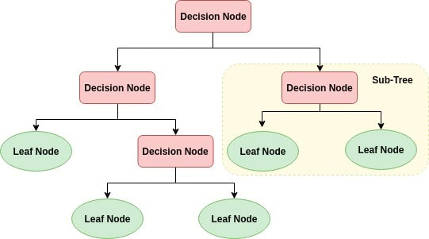

# Classification and regression trees (CART)

Decision Trees are excellent tools for helping you to choose between several courses of action.

They provide a highly effective structure within which you can lay out options and investigate the possible outcomes of choosing those options. 
They also help you to form a balanced picture of the risks and rewards associated with each possible course of action.

    

Decision trees have a number of advantages as a practical, useful managerial tool.
- Easy to Use: Decision trees are easy to use and explain with simple math, no complex formulas. They present visually 
all of the decision alternatives for quick comparisons in a format that is easy to understand with only brief explanations.
- Decision trees require relatively little effort from users for data preparation.#
- Can handle both numerical and categorical data. Can also handle multi-output problems.
- Nonlinear relationships between parameters do not affect tree performance.

### Implementation details

The basic idea behind any decision tree algorithm is as follows:

- Select the best attribute using Attribute Selection Measures(ASM) to split the records.
- Make that attribute a decision node and breaks the dataset into smaller subsets.
- Starts tree building by repeating this process recursively for each child until one of the condition will match:
  + All the tuples belong to the same attribute value.
  + There are no more remaining attributes.
  + There are no more instances.

In other words, the split with the best cost (lowest cost because we minimize cost) is selected. All input variables and all 
possible split points are evaluated and chosen in a greedy manner based on the cost function.

*Regression*: The cost function that is minimized to choose split points is the *sum squared error* across all 
training samples that fall within the rectangle.
*Classification*: The *Gini cost function* is used which provides an indication of how pure the nodes are, where 
node purity refers to how mixed the training data assigned to each node is.

Splitting continues until nodes contain a minimum number of training examples or a maximum tree depth is reached.

###### Classification

The Gini index is the name of the cost function used to evaluate splits in a classification problem.

THe parameters of Gini index involve one input attribute and one value of that attribute. They will be used to 
divide training data into two groups of rows (hence binary tree).

A Gini score gives an idea of how good a split is by how mixed the classes are in the two groups created
by the split. A perfect seperation results in a Gini score of 0, whereas the worst case split
that results in 50/50 classes in each group result in a Gini score of 0.5.

### Result

Decision tree for classifying banknote's authentication. Dataset can be found at: https://archive.ics.uci.edu/ml/datasets/banknote+authentication

### Some disadvantages of CART
- Decision trees can be unstable because small variations in the data might result in a completely different tree being 
generated. This is called variance, which needs to be lowered by methods like bagging and boosting.
- Greedy algorithms cannot guarantee to return the globally optimal decision tree. This can be mitigated by training multiple trees, 
where the features and samples are randomly sampled with replacement.
- Decision tree learners create biased trees if some classes dominate. It is therefore recommended to balance the data set 
prior to fitting with the decision tree.

### References
- [How decision trees work](https://www.youtube.com/watch?v=9w16p4QmkAI)
- [CART (Algorithmus)](https://de.wikipedia.org/wiki/CART_(Algorithmus))
- [Decision Tree Learning](https://en.wikipedia.org/wiki/Decision_tree_learning)
- [Predictive Analysis # Classification and regression trees (CART)](https://en.wikipedia.org/wiki/Predictive_analytics#Classification_and_regression_trees_.28CART.29)
- [Decision Tree Classification - Avinash Navlani](https://www.datacamp.com/community/tutorials/decision-tree-classification-python)
- [Decision Tree Classification - Afroz Chakure](https://towardsdatascience.com/decision-tree-classification-de64fc4d5aac)