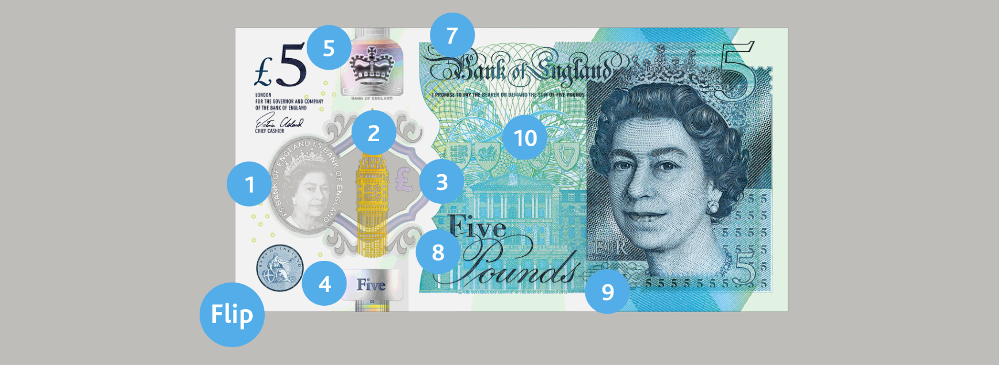
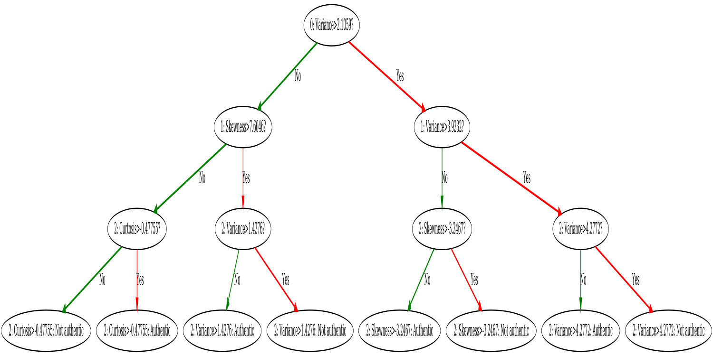

# Classification and regression trees for banknote authentication (CART)

Decision Trees are what most people have in mind when questioned of machine learning. A clear path decision plan with if/else and you get a guide what to do at the end of the path. The difference between decision tree and if/else is, you don't have to program the rules of a decision tree yourself. The principle is very simple, data as input and you get your rule set as output. The rule set is also very explainable (as in the result chapter), so you as an engineer will have an easier time explain the decision of your model to the bussiness and marketing side of the company.

Surprisingly, despite of the simplicity decision tree can be a very powerful tool. For many problems on [Kaggle](https://www.kaggle.com/) I could achieve
a production-ready accuracy with a composition of many decision trees (also called random forrest). The training time and the memory foot print are also very great. As opposite to neural network, a reasonable good model of a very huge dataset can be somewhere between Kbs and Mbs.

This repository is a case study of how decision tree implemented without any 3rd-party library can achieve a reasonable result for 
prediction analysis. The final result of a single decision tree will be compared with the result of composition of three decision trees.

### Result
The task was to classify banknote's authentication. Dataset can be found at: [www.uci.edu](https://archive.ics.uci.edu/ml/datasets/banknote+authentication):
- **Dataset size**: 1372 samples
- **Data shuffle**: Yes
- **Data balanced**: Yes
- **Training / Testing ratio**: 75/25

Single decision tree provides a significant accuracy over random dummy model:
- **Max depth**: 3
- **Min leaf's size**: 1
- **Average training accuracy of 100 random trees**: 76%
- **Average testing accuracy of 100 random trees**: 73% 

Random Forrest (Wisdom of the crowd) provides a significant boost of accuracy toward single decision tree:
- **Forrest size**: 3
- **Max depth**: 3
- **Min leaf's size**: 1
- **Average training accuracy of 100 random trees**: 87%
- **Average testing accuracy of 100 random trees**: 88% 

Visualization of a single decision tree:

### Implementation details

The basic idea behind any decision tree algorithm is as follows:

- Select the best value of the best attribute using Gini Index to split the records. This is the computational most expensive process. 
Each attribute for each value of the record can be the best split index, so the brute force approach must be used.
- Make that best value of the best attribute a decision node and breaks the dataset into two smaller subsets.
- Starts tree building by repeating this process recursively for each child until one of the condition will match:
  + All the tuples belong to the same attribute value.
  + There are no more remaining attributes.
  + There are no more instances.

The parameters of Gini index involve one input attribute and one value of that attribute. They will be used to 
divide training data into two groups of rows (hence binary tree). A Gini score gives an idea of how good a split is 
by how mixed the classes are in the two groups created by the split. A perfect seperation results in a Gini score of 0, whereas the worst case split
that results in 50/50 classes in each group result in a Gini score of 0.5.

Random forrest on the otherhand is an abstract modelling concept which can be used for every machine learning algorithm. The basic idea is that 
forests of trees splitting with oblique hyperplanes can gain accuracy as they grow without suffering from overtraining, 
as long as the forests are randomly restricted to be sensitive to only selected feature dimensions. The accuracy of each single tree
could be only slightly better than random, but the error of each tree is random. By combining many trees together, the error rate
of the whole crowd converges to zero can therefore yields a much better result than each individual tree can do.

### Some disadvantages of CART
- Decision trees can be unstable because small variations in the data might result in a completely different tree being 
generated. This is called variance, which needs to be lowered by methods like bagging and boosting.
- Greedy algorithms cannot guarantee to return the globally optimal decision tree. This can be mitigated by training multiple trees, 
where the features and samples are randomly sampled with replacement.
- Decision tree learners create biased trees if some classes dominate. It is therefore recommended to balance the data set 
prior to fitting with the decision tree.

### References
- [How decision trees work](https://www.youtube.com/watch?v=9w16p4QmkAI)
- [CART (Algorithmus)](https://de.wikipedia.org/wiki/CART_(Algorithmus))
- [Decision Tree Learning](https://en.wikipedia.org/wiki/Decision_tree_learning)
- [Predictive Analysis # Classification and regression trees (CART)](https://en.wikipedia.org/wiki/Predictive_analytics#Classification_and_regression_trees_.28CART.29)
- [Decision Tree Classification - Avinash Navlani](https://www.datacamp.com/community/tutorials/decision-tree-classification-python)
- [Decision Tree Classification - Afroz Chakure](https://towardsdatascience.com/decision-tree-classification-de64fc4d5aac)
